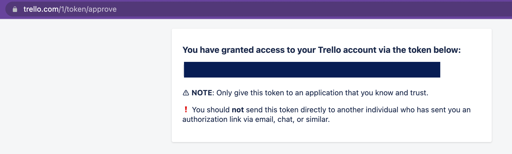

## Note1: Prior to using the bot or performing acceptance testing, the user needs to complete all the following steps in the Deployment Instructions section till the start of Acceptance Instructions section. The Acceptance instructions is near the end of the document.

## Note2: Our team cannot create Trello accounts for the TA's or Instructors since we require it to be done using the NC State Unity Email IDs and Trello is an external service which we cannot control. Therefore, in order to conduct acceptance testing on the bot running on VCL, the Instructors need to create their own Trello accounts, populate the database with  necessary credentials and also add the required Environment variables and tokens in the secret-vars.yml file submitted in the Google form. All of this is completed by following the steps in the User Registration section below.

# Deployment Instructions and Screencast link

## NodeJS app

All the code associated to run the bot application is included in the repository, which can be run with `node index.js`.

However, to run the app successfully, it uses multiple tokens (in the form of environment variables and user-level data(See [below](#user-registration-into-the-bot-database)))

The tokens used by the bot as environment variables are listed below:

### GitHub token for GitHub:

    GITHUB_TOKEN: 

This token is used to authenticate with GitHub

### Bot token for Mattermost

    BOTTOKEN: 

This is personal access token which is used to authenticate the bot with Mattermost

#### Trello creds

    TRELLOWORKSPACE: 

This environment variable identifies the Trello workspace that will be used to create the boards, and cards.

#### PostgreSQL creds

    psgsqluser: 

The user to use to authenticate into PostgreSQL

    pgsqlpwd:

The password for the above user.

    portno:

The port to connect with

    pgsqlhost:

The host to connect with to the database

    pgsqldb: 

The name of the database to connect to

## PostgresSQL Database

The database table has the following schema:

| Column     |          Type          | Purpose |
| ------------ | ---------------------- | --------- |
 userid        | character varying(40)  | Stores the Trello UserID for a user          |          | 
 useremail     | character varying(40)  | Stores the `@ncsu.edu` email for a ["registered user"](#user-registration-into-the-bot-database) user          |
 activeboardid | character varying(40)  | Keeps track of the activeboard for a user          |
 usertoken     | character varying(100) | The Trello token associated with the user          |
 userkey       | character varying(100) | stores the TRELLO API key associated with the user |

## Ansible Setup

1. To run ansible to setup the bot.

2. User needs to have `ansible>=2.9` . If not present , can be installed using *sudo apt install ansible*.

3. Then,the user needs to install the following ansible collections as follows:

        ansible-galaxy collection install community.general
        ansible-galaxy collection install community.postgresql

4. Create a file named `secret-vars.yml` on the control node, by following the template given in the `secret-vars.template.yml` file.

In the `secret-vars.yml`, fill in all the credentials that have been supplied via the Google Form.

5. Run the following command to run the playbook:

        ansible-playbook -e @secret-vars.yml install-app.yml

6. (OPTIONAL) To see how the database should look like, we have provided sample queries given in "queries.sql" submitted via the google form in the TOKENS.zip.

The teaching staff can optionally add this data to see how the database should look like. 

Note: without this data, the team 4 users will not be able to user the bot. (See [here](#user-registration-into-the-bot-database))

Using those sample queries the database can be populated with the necessay data to allow the 4 team members to use the app.

To add the data for the existing Team users to the database, follow the instructions:
    a. Ansible should have setup the database correctly
    b. Run the following command on the terminal to open the database:
            `psql -U <pgsqluser> <pgsqldb>`
    c. In the following prompt, enter the `pgsqlpwd`.
    d. Now you should be in the PostgreSQL prompt.
    e. Paste the `insert query` from the sql file supplied by the team, to insert data for the team.

(For more details, see [here](#user-registration-into-the-bot-database)).

7. To allow the teaching staff to use the app, please add the relevant database rows by following the instructions in the following section.

## User registration into the bot database

##### Note: The below process could have been automated but it may have resulted in heavier use cases. Hence, we decided to do it manually. It can be added as part of the future work.

Before a user can use the bot, they need to satisfy the given prerequisites:

1. They have an account on Trello.com (They need to do "Login with Google" using their `@ncsu.edu` account)

2. They need to be added to the workspace identified by `TRELLOWORKSPACE`. This token is given in the secret-vars.yml file submitted in the Google Form.

3. They should have a row in the PostgreSQL table `bot`, so that the bot knows how to identify the user interacting with it.

4. They need to be added to the workspace. For this, an invitation email has been sent to all TAs and instructors.

For adding more users to the bot, the "sys admin" needs to perform the following steps:

1. Ask the new user to register on Trello with their NCSU Google account (When signing up, use `Login with Google` option)

2. Get the user's user's key and token and user Id using user's key and tokent. 

    a. Getting a user token and user key.

    Please refer to [this webpage](https://developer.atlassian.com/cloud/trello/guides/rest-api/api-introduction/#authentication-and-authorization) for any clarifications.
        i. Go to https://trello.com/app-key. (Make sure you are logged into https://trello.com before accessing this webpage)
        ii. Please note this API-key as well. Store it as `$USER_KEY`. (This app key is associated with each user, and will be used along with the token to find the user's userId )
        iii. Click on "Generate a token" 
        iv. Follow the instructions to generate a token.
        
        v. Store this token as `$USER_TOKEN`
    
    b. Now, the new user can find their userId with the following API call:

    Using the user token, perform the following curl command:

        curl 'https://api.trello.com/1/members/me?token={USER_TOKEN}&key={USER_KEY}' | jq ".id"
    
    Please note: use both the USER_TOKEN and USER_KEY from the token and key obtained from the new user's logged in account.
    
    Now, we have the new user's userId as $USER_ID

3. Please share the `$USER_TOKEN`, `$USER_KEY` and `$USER_ID` with the system admin.

4. Finally, the system admin needs to invite the user to the workspace.

The team has sent invite emails to the teaching staff to the existing workspace being used by the team.

The teaching staff needs to accept the email, AND *LOG IN WITH GOOGLE* to sign up.

OR

The system admin can create a new workspace as follows:

They need to add the activeboard id for a board that the new user is invited on .

Create a new board manually, and note it's board id, and add this id to the activeboardid. 

Using userid, user key and user token, perform the following curl command:

    curl  "https://api.trello.com/1/members/{USER_ID}/boards?key={USER_KEY}&token={USER_TOKEN}"

The first id in the response is the board id, set this id as activeboardid. 

5. Finally, insert the row as follows

        INSERT INTO bot(userid, useremail, activeboardid, usertoken, userkey)
        VALUES('$USER_ID', '<unityId>@ncsu.edu', '<boardIdForTheBoard>' , '$USER_TOKEN', '$USER_KEY' )
Examples of above query are also given in "queries.sql" submitted via the google form along with the Tokens in the TOKENS.zip.

## Things to note:

The Trello Workspace has a limitation of 10 boards at any given time. Please delete a few boards if this limit is reached.

## Worksheet.md

[Worksheet](/worksheet.md)

## SCREENCAST VIDEO LINK

## References:

1) For any doubts with Trello API tokens and keys, please refer to [this webpage](https://developer.atlassian.com/cloud/trello/guides/rest-api/api-introduction/)

---

# Acceptance Testing Instructions

**Before starting acceptance testing:**

1. The app must be running on NC State VCL.
2. Complete all the steps in the above "Deployment Instructions" from the start of the document till this point.
3. Trello account must be created using the NC State email id.
4. Mattermost username must be NC state UnityID.
5. All users must be part of the workspace: Trello Workspace CSC510 (Invitation links have been sent to all TAs and the instructor)

**Tests:**
- **Test 1: Verify whether user is able to create new project kanban board on Trello.**
    - **Precondition:** User should be have the ontrack bot channel open on Mattermost.
    - **Steps:** 
      - Run the following command in the text box: createBoard <boardname>
      - Note in the above command, the board name must not contain spaces or special characters. It must be only alphanumeric.
    - **Expected Output:** Following text along with the link to a new Trello board is displayed: "This is the link to the board <url_for_trello_board>"
    - 

---

- **Test 2: Verify whether the current active board is displayed to the user.**
    - **Precondition:** User must have created at least one board and must be member of the Trello workspace for them to have an active board.
    - **Steps:**
      - Run the following command in the text box: displayActiveBoard
    - **Expected Output:** Following text is diplayed: Active board is "<board_name>"
    - 

---

- **Test 3: Verify whether user can set a board as the new active board.**
    - **Precondition:** User must have the short id for the board to be set as active. The board to be set as active must exist.
    - **Steps:**
      - The short ID for the board can be obtained from the board url as shown in the example below. The short ID is part of the url and is highlighted in yellow.
      - Run the following command in the text box: setActiveBoard <short_id>
    - **Expected Output:** Following text is diplayed: Active board changed to: <url_for_active_board>
    - 
    - 

---

- **Test 4: Verify that new task can be added to the todo list of the current active board with optional parameters collaborators and description.**
    - **Precondition:** User must have a active board. Any collaborators to be added must be part of that board. This must be done by manually going on Trello website to your project board and sharing the board with collaborators as shown in the screenshots below. Use the share button as shown in red.
    
    

    - **Steps:**
      - Run the following command in the text box: addtask <task_name> --collab @user1 @user2 @user3 --description <task_description>
      - Note that in the above command, the added collaborators "user1, user2, etc" must be part of that project board.
    - **Expected Output:** Following text is displayed along with the url to the newly created task card: Card was created successfully: <url_to_card>
    - 
    - Following is the card created by the above shown command.
    - 

---

- **Test 5: Verify that tasks in todo list, inprogress list, and done lists are displayed to the user.**
    - **Precondition:** User must have an active board with todo, inprogress and done lists.
    - **Steps:**
      - To display the tasks specifically assigned to the user, run following command in the text box: listTasks <todo/inprogress/done>
      - To display all tasks assigned to all users of the board, run following command in the text box: listTasks <todo/inprogress/done> --all
    - **Expected Output:** Following is an example of the type of output displayed:
    - 

---

- **Test 6: Verify that the user is able to move a task card from todo list to inprogress list, and from inprogress list to done list.**
    - **Precondition:** The user must have the ID of the card to move. This can be obtained by running the "listTasks" command explained above. The card must exist in the todo or inprogress list.
    - **Steps:**
      - Run the following command in the text box: moveTask <destination_list> <card_ID>
      - NOTE: Here the destination list is either **inprogress** or **done** list. It is assumed that the card is currently in the list preceding the destination list once.
      - EXAMPLE: If destination list is inprogress, then card must currently be in todo. And if Destination list is done, the card must be currently in inprogress.
    - **Expected Output:** Following text is displayed if the card is moved: Card successfully moved.
    - 

---
**Note: In case the bot fails to respond, it can be assumed that an error has occurred, possibly due to incorrect command being entered by the user.**
