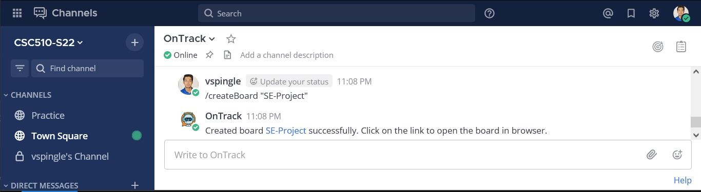
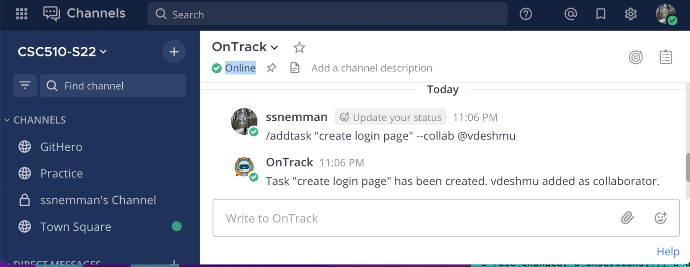
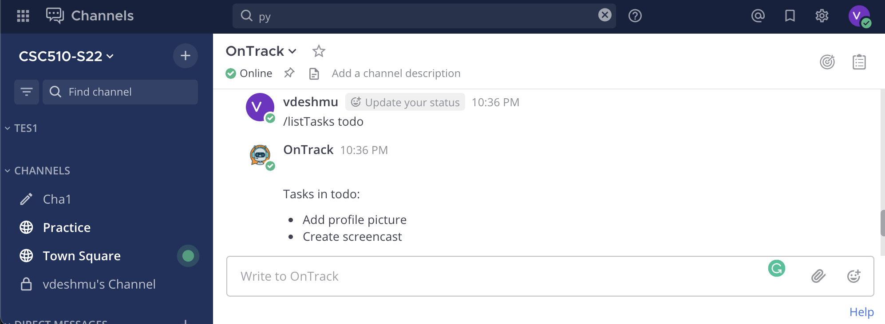
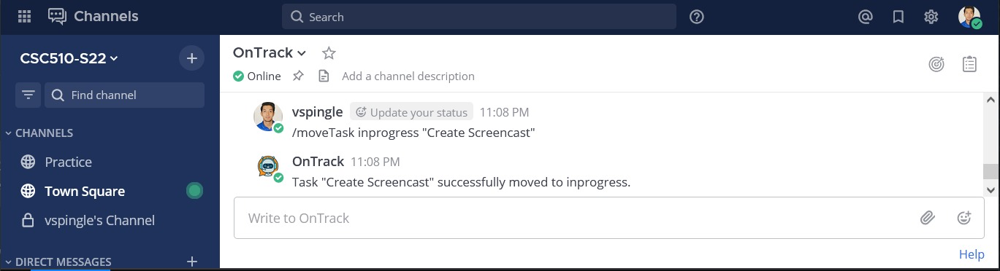
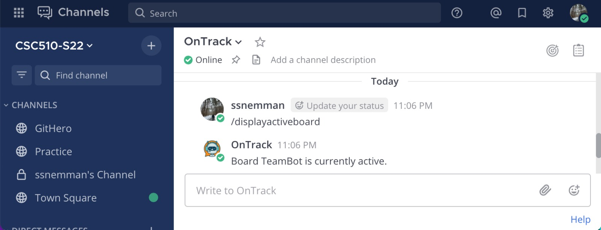
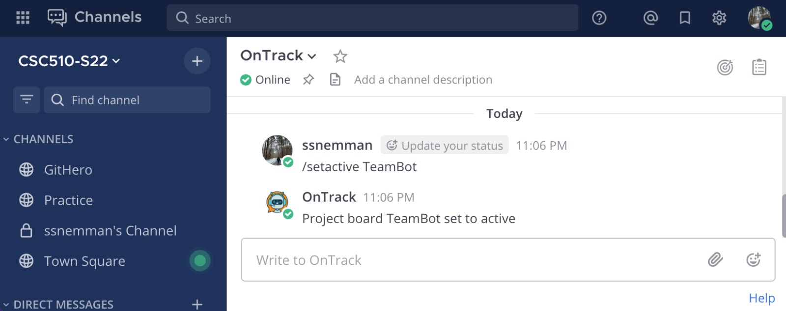
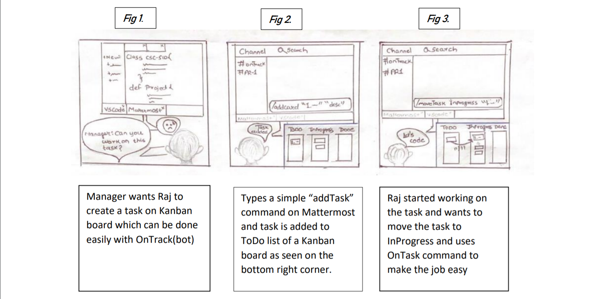
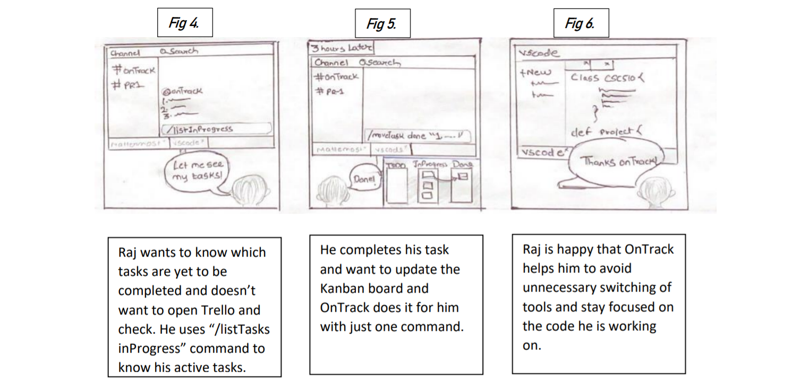
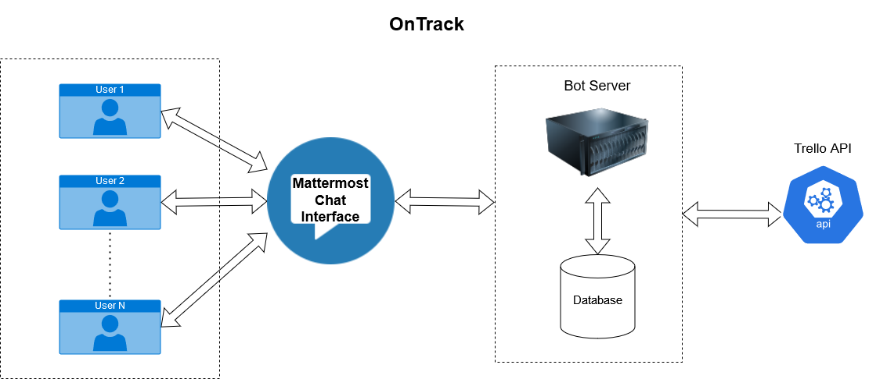
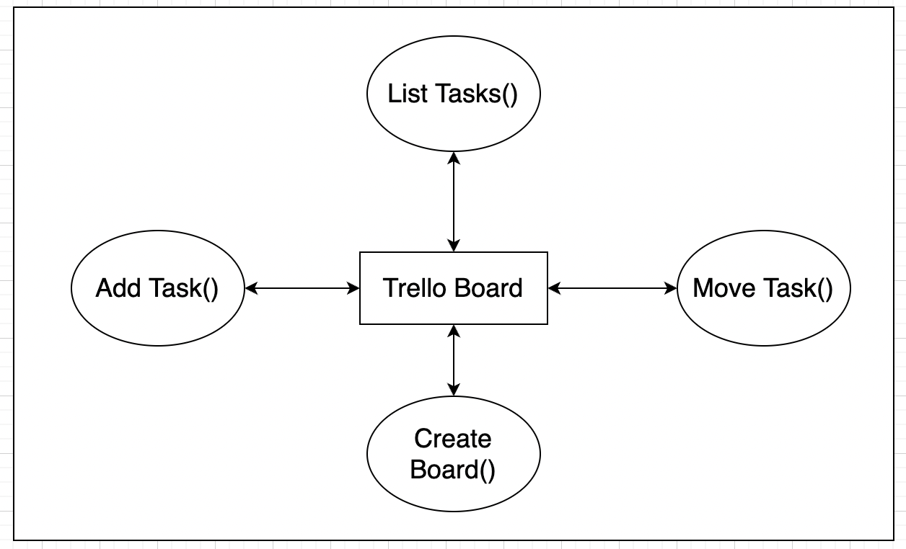

### Problem Statement

The problem is lapses in software developer productivity due to factors like unclear or disorganized goals, frequent interruptions or distractions, constant context switching among multiple tools, communication overload between teammates and lack of coordination across tasks.

This problem is important because decline in developer productivity results in loss of developer time and revenue for the company. This costs the company a lot of money and resources. Increasing productivity of the developer is in the best interests of both the developer and the company.

One of the important factors responsible for breaking developer’s state of flow is frequent context switching. Developers often switch between different tools and platforms like IDEs, Github, Trello, Zoom, etc on a daily basis. For example, creating a new task on Trello requires a developer to switch to the browser, navigate to/open a tab with Trello, then click on the GUI using a mouse in the correct list to create a task in their team kanban board. This process can be simplified so that it requires less time to perform for each developer and thereby saving the company time.

We aim to tackle specifically these problems of context switching and task organization by building a bot to automate Trello Kanban boards. Note: Although Trello bot(s) exist on platforms like Slack/Mattermost, Trello as a whole is designed to support any kind of project board configuration, but we are targeting the *specific use case of Trello when it is used as a simple kanban board*.


### Bot Description

The bot will replace existing GUI workflows with a simple text-based interface. It provides text commands which can replace the process of changing applications and then performing a GUI workflow, which can be annoying to perform multiple times a day. 

The bot is a solution to context switching and avoiding lengthy processes which could otherwise be automated, as a complex interface with many options has been boiled down to a simpler API which covers majority of the usages of the API. If these processes are automated using bots, it can reduce friction from tool switching and help the developer maintain a state of flow. 

The bot plans to simplify the process of managing a basic kanban project board via text commands as opposed to GUI workflows. For example, with the Trello GUI, a developer has to change windows to go to the browser, then they have to switch to the correct browser tab and then continue the process of dragging the cards between tabs. It is likely that developers have lots of browser tabs open. This process slows down your workflow, and there is an opportunity for errors while carrying out such tiresome work.

The intended workflow is as follows: users write text commands on Mattermost bot channel that specify the action to be done on the Kanban board. This triggers the bot which acts using the Trello API to perform the specified task. For example, `moveTask done "card title/id"` would move a card from "inprogress" to "done" list in the project board. `addTask "title"`  would create a card and will be placed in “ToDo”. Similarly, there are commands that would list cards within the lists that are assigned to fthe given user (developer).


### Name & Tagline
OnTrack- keeps you on track !!

### Use Cases 

```
    1 : Create a new project board
    
    Preconditions:
    User has access to the bot’s chat window. 
    User must have a Trello account with registered with the same email id as used for the Mattermost account.
    
    Main Flow:
    User writes a command to create a new “basic kanban” board for the project [S1]. The bot creates a new project board using the trello API [S2].
    
    Subflows:
    [S1] User runs the command “createBoard <projectName>”
    [S2] Using the trello API, a new board is created by the bot.
    
    Alternative flows:
    [E1] If a project with the same name is already created, then the bot mentions this fact and does not do anything.
```
```
    2 : List tasks in todo/done/inProgress lists

    Preconditions:
    User has a project board set as active with the OnTrack bot.
    User must have a Trello account and be a part of the project board.
    User must have some tasks present in the “done”, ”InProgress”, etc. columns. 
    
    Main Flow
    User types out the command to show his own tasks of a particular list in the current project board [S1]. The bot retrieves the corresponding task list assigned to that user and displays it on the channel [S2].
    
    Subflows
    [S1]User provides "listTasks <list_name>"  command to the bot.
    [S2]Bot will retrieve tasks from the specified list and puts them on the chat for the user.
    
    Alternative Flows
    [E1]No project set as active with the OnTrack bot, then the bot will set this project as default and user will be notified about this.
    [E2]If there are no tasks present in the “done” list, the bot will print a message stating this fact.
```
```
    3 : Moves card from todo/inprogress to inprogress/done
    
    Preconditions
    User has a project set as active with the OnTrack bot.
    User must have an account on Trello and be a member of the project board.
    User must have a card that is in the “To Do”/”InProgress” column. 
    
    Main Flow
    User will request a card to be moved to the “In Progress”/”Done” list using the command “moveTask <list_name> ‘card’ “ [S1]. The bot removes that card from its current list and adds it to the specified list [S2].
    
    Subflows
    [S1] User provides the "moveTask <destination_list_name> ‘card’ "  to the bot. Alternatively user can also specify the id associated with the card.
    [S2] The bot will remove the card from the current column and add it to the column/list provided by the user.
    
    Alternative Flows
    [E1] If the card is not present in the particular list, bot  will ask the user to check the command.
    [E2] If the card is already in the column to be moved, the bot will return a message displaying the same.
```
```
    4 :  Add new task to kanban board
    
    Preconditions: 
    Active board has to be set to that particular required project board.
    User must have an account on Trello and be a member of the project board.
    
    Main Flow:
    User will type out the title of the task to be added to the active board and its description(optional) [S1]. User will list other members to be added for that task as collaborators [S2].
    
    Sub Flows:
    [S1] User type the task title to be added.
    [S2] User will specify collaborators as @username, @username 
    
    Alternate Flows:
    [E1] No kanban board has been set as active. OnTrack bot will inform the user of this.
```
```
    5 : Set board to active
    
    Preconditions: 
    The board to be set active must exist.
    User must have an account on Trello and be a member of the project board.
    
    Main Flow:
    User will type out the command with the name of the board to be made active [S1]. The bot will change the state of specified project to active [S2].
    
    Sub Flows:
    [S1] User type the the "setActive <board_name>" command to the bot.
    [S2] The bot will run a query to change the state of specific project board to active on the database.
    
    Alternate Flows:
    [E1] No kanban board has been set as active. OnTrack bot will inform the user of this.
```
```
    6 : Show current active board
    
    Preconditions:  
    User must have an account on Trello and be a member of the project board.
    
    Main Flow:
    User will type out a command to display the board that is currently active [S1]. The bot retrieves the active project boards and displays it on mattermost [S2].
    
    Sub Flows:
    [S1] User types the "displayActiveBoard" command to the bot.
    [S2] The bot fetches the database for active project boards and displays the retrieved information to the user.
    
    Alternate Flows:
    [E1]If there are no active boards,the bot will display a message stating no active boards.
```


### Design Sketches

#### Wireframes

Please note: Wireframes have been created by modifying the Mattermost webpage based on the intended command usages and outputs.

1. Create project board



2. Create new task



3. List todos



4. Move task



5. Display active board



6. Set Active




#### StoryBoard




Please note: The bottom right corner shows the Trello webpage as it would look after each command. This window is **NOT** visible to the user while they are working. It is only shown in the storyboard to illustrate the changes being made via the commands through Trello API.


### Architecture Design

#### Architecture Diagram


#### Architecture Description

The architecture diagram above shows the different components used by the OnTrack bot. It can be divied into following parts

#### *Mattermost:*

* The end user interacts with the bot through the mattermost chat service, where they enter the slash text commands. The bot is integrated with the mattermost, and based on the command entered by the user, the bot calls the necessary APIs and runs its internal logic. 
* The bot will parse the command, and based on the nature of the command it will query the Trello REST API, with the correct API call and perform the corresponding task.


#### *Trello:*
* Trello is a collaboration tool that organizes your projects into boards. In one glance, Trello tells you what's being worked on, who's working on what, and where something is in a process. 
* The Kanban Method has been used to improve productivity and optimize processes. We use Trello as a way to manage card creation/board management tool. All the necessary data for cards/team members and kanban todo/inprogress/done lists is maintained by the Trello application. 
* The Trello REST APIs allow us to interact with this data, and manipulate it as needed. With this approach, all the necessary data is maintained within Trello, thereby simplifying the bot's architecture.

#### *Database:*
* For storing user data, we will be using database like PostgreSQL, Microsoft SQL, SQLite, etc. as xternal data storage entity The database will be used to store data regarding active boards for the particular user.
* For the purposes of this diagram, user data (as of now) includes details like "current active project" for each user.
* For example, as the user can create multiple kanban projects, and since most of the bot commands work within the context of a single project, we need to set up a single "active" project for the bot.
There can be multiple concurrent users for whom we need to store this data. Hence, it makes sense to have an external database to store this kind of user "config" data. If in future, 

#### *Bot Server:*
* The bot server is a software application that runs automated tasks like scanning content, interacting webpages, chatting with users.
* The bot server processes the input command and calls an appropriate Trello API. We are planning to host this server on a cloud platform like AWS, Azure, Heroku, etc.

#### Constraints

* The user must login to mattermost using university email id.
* The bot does not understand human context and user must use predefined commands.
* The bot will keep track of tasks using kanban board in trello.

#### Architectural Patterns

Repository:

The OnTrack bot updates the shared data stored on Trello only when a client sends in a request such as add task/move task. This requests are independent of one another and are triggered by client requests. Therefore the shared data store is passive and we use a **Repository based architecture** as depicted in the below diagram.


