## Process documentation

## **Meeting Notes**
#### Date: 03/21/2022
1)  What did you accomplish since the last meeting?:
    * This is the first meeting of the coding sprint. Hence, no prior pending tasks.

2) What you're working on next
    * Planning tasks/stories for the first iteration.
    * Decide core and corollary practices for coding sprints

3) Any blockers or obstacles 
    * No blockers so far, as stories are being created.

4) Stories to implement in sprint 1:
   * Create new project board on Trello
   * Add task to a list on current active project board with collaborators
   * Display tasks in a list (todo, inprogress, done)
   * List tasks in the current board
   * Tests for the use cases

#### Date: 03/22/2022
1)  What did you accomplish since the last meeting?:
    * Remove mocks from the ListTasksHandler and test code with actual API calls
    * Settled on Collective Code Ownership as core practice and shared code as corollary practice

2) What you're working on next
    * Merge updated code for list tasks use case with dev
    * Implement tests to test the list tasks use case

3) Any blockers or obstacles 
    * None

#### Date: 03/23/2022
1)  What did you accomplish since the last meeting?:
    * Submitted and merged PR for running Trello API calls for List Tasks use case
    * Setup Postgres SQL locally to work on show active board task

2) What you're working on next
    * Work on display active board task
    * Implement tests to test the list tasks use case

3) Any blockers or obstacles 
    * Discuss assumptions regarding add task (Add tasks to todo by default or not?)
    * Add task command syntax for adding collaborators.

#### Date: 03/24/2022
1)  What did you accomplish since the last meeting?:
    * Ran tests on updated code merged with dev
    * Display active board task completed
    * Create board mocking removed

2) What you're working on next
    * Note prerequisite conditions for add task to work
    * Implement tests to test the list tasks use case
    * Code style checks. Cleaning up code. Refactoring. Adding comments.

3) Any blockers or obstacles
    * How can we increase test coverage further?
    * How to handle special characters in task names? (Permit special char or only alphanumeric characters?)
    * Fix database entries to simplify trello board lookup

#### Date: 03/25/2022
1)  What did you accomplish since the last meeting?:
    * Special characters were allowed in task names.
    * Use cases such as Addtask, createBoard and the required test cases were completed.
    * Removed unnecessary console log statements and added comments in code.
    * Added API calls for addtask command.

2) What you're working on next
    * Plan and discuss user stories and tasks for next sprint.

#### Date: 03/26/2022
1)  What did you accomplish since the last meeting?:
    * Completed iteration one successfully.
    * Discussed approach for iteration 2 tasks.
    * Created initial stories for iteration 2.

2) What you're working on next
    * Start working on the assigned stories.

#### Date: 03/27/2022
1)  What did you accomplish since the last meeting?:
    * Finalized the specifics in deciding how to implemet moveTask.
    * Created the basic structure of the moveTask

2) What you're working on next
    * Add multi-user support by storing more details in the database.

#### Date: 03/28/2022
1)  What did you accomplish since the last meeting?:
    * Started working on setActive board task.
    * Completed moveTask

2) What you're working on next
    * Add tests for moveTask
    * Complete setActive board task.

3) Any blockers or obstacles
    * ShortId cannot be used to update db, so need to resolve this.
      (Resolve is to query all boards, and find board based on shortid and then use the matched board object to get the 23 digit id.)

#### Date: 03/29/2022
1)  What did you accomplish since the last meeting?:
    * Completed moveTask test cases.  
    * Completed basic code structure for set active board task.
    * Started working on multi-user support.

2) What you're working on next
    * Complete set Active board task.
    * Add set active board test cases.

#### Date: 03/30/2022
1)  What did you accomplish since the last meeting?:
    * Completed set active board task.
    * Completed test cases for set active board task.
    * Updated DB schema by adding a column for user token.

2) What you're working on next
    * Testing all the tasks using mattermost for functionality.
    * Testing multiuser support.

#### Date: 03/31/2022
1)  What did you accomplish since the last meeting?:
    * Tested all the usecases successfully without any blockers.
    * Tested multiuser support functionality successfully.

2) What you're working on next
    * Working on creating the iteration worksheet for iteration 2.
    * Working on documenting the status and process reflection as discussed during meeting.

#### Date: 04/01/2022
1)  What did you accomplish since the last meeting?:
    * Ensured there were no edge cases to cover.
    * Demo was completed smoothly.
    * Reviewed the final version of PROCESS.md file.

## **Story Creation and Assignment**

Screenshots of kanban board in order of changes made. One screenshot per each date as mentioned above.

**Iteration 1**

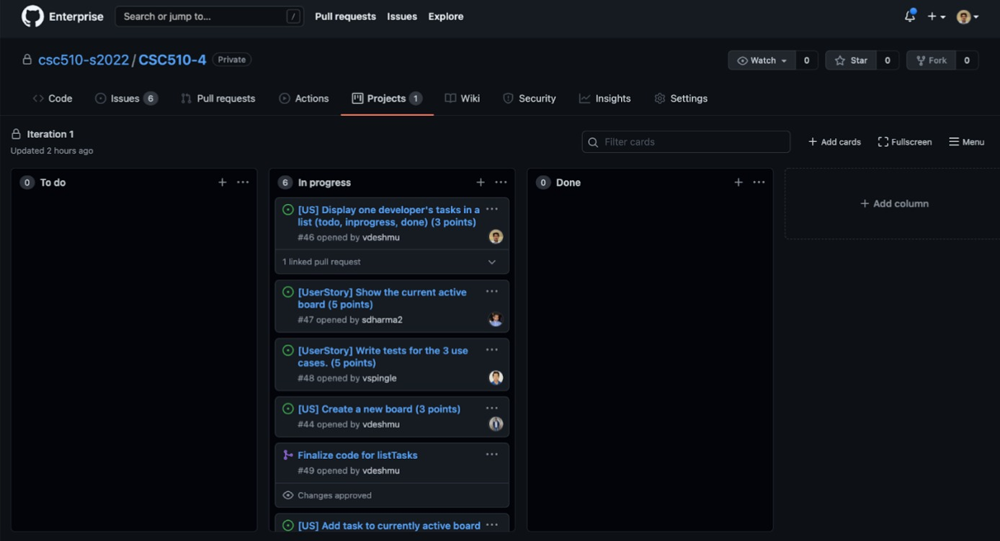

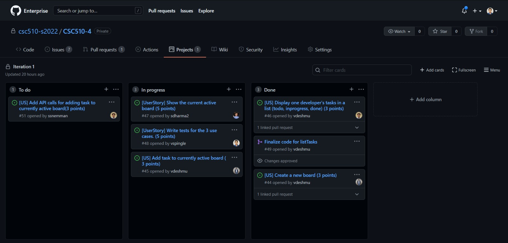

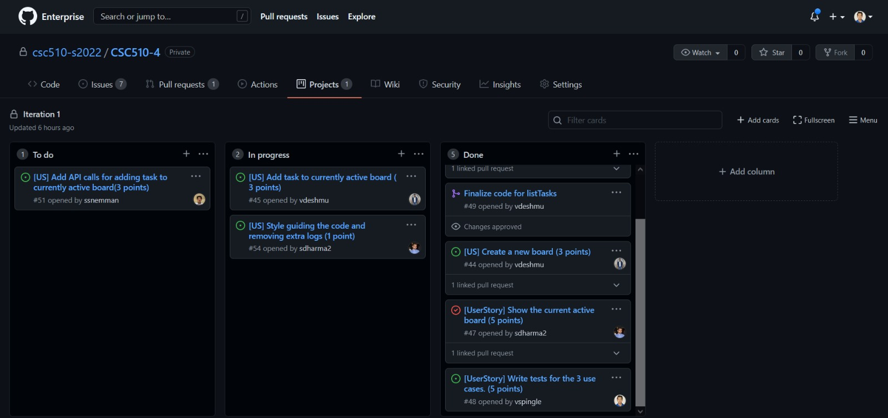

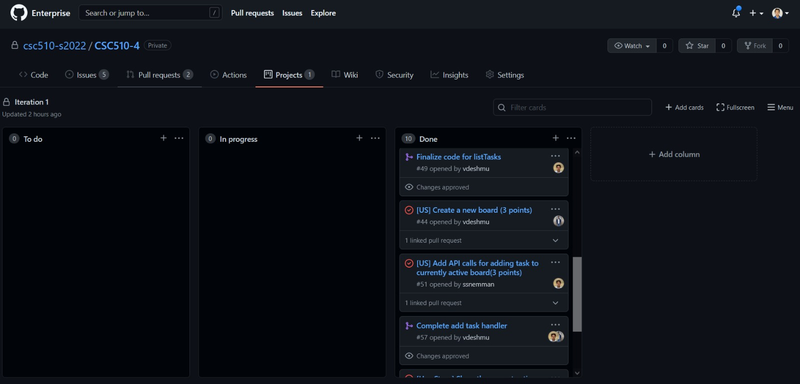

**Iteration 2**

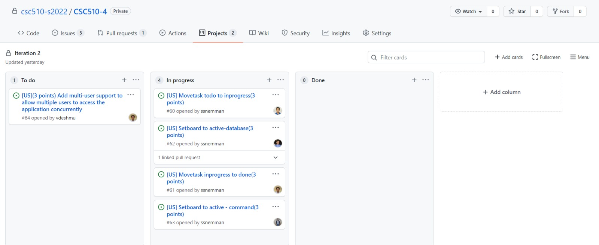

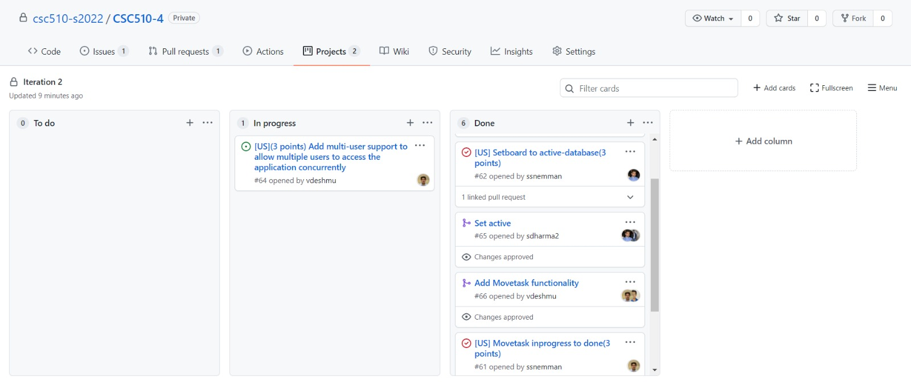

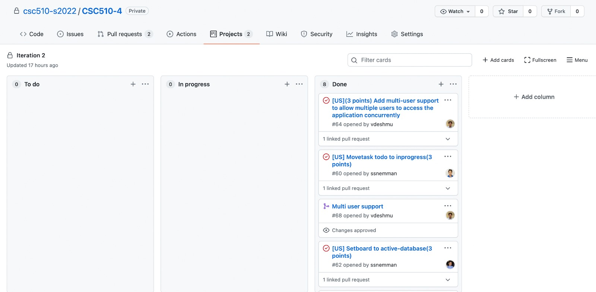

## **Status and Process reflection**

**Iteration 1**
- Our team was largely successful in meeting the targets and goals set at the start of the sprint.
- 4 out of 6 use cases have been successfully implemented.
- The next sprint will be focused on implementing the remainder use cases, additional tests to increase coverage and add finishing touches to the features.
- Key takeaway from this sprint was the importance of software processes like Scrum, Kanban and Peer reviews. These helped streamline the development process and effectively keep track of progress.
- Completed tasks:
  * Create new project board
  * Show List tasks
  * Display current active board
  * Unit tests for the above use cases
  * Add tasks to a list

- Tasks to be completed in next sprint:
  * Move cards from todo/inprogress lists to inprogress/done list.
  * Set a board to active state.
  * Implement additional tests for newly implemented use cases and increase coverage.

**Iteration 2**
- The remaining 2 use cases have been successfully implemented.
- Implemented unit tests for all the use cases to get the code coverage above 80%.
- Key takeaways from this sprint were the benefits of writing testcases to debug code, refactoring of code for efficient performance , code collaboration on particular features. These techniques assisted in the improvement of our software development process from the previous iteration, as well as the code's consistency.
- Completed tasks:
  * Move Task from todo to inprogress, inprogress to done
  * Set a board to active
  * Unit Tests for above tasks
  * Add multi user support for concurrent access of application

## **Practices**

- In order to improve our software development process we have implemented collective code ownership as our core practice(XP practice) and shared code as our corollary practice. 

- ### **Collective code ownership** (core practice):-
    * The set active board task was owned collectively by two members of the team. It helped improve the code quality and kowledge sharing helped us learn and improve this feature of the bot.

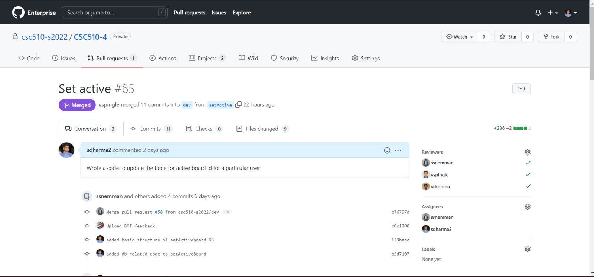

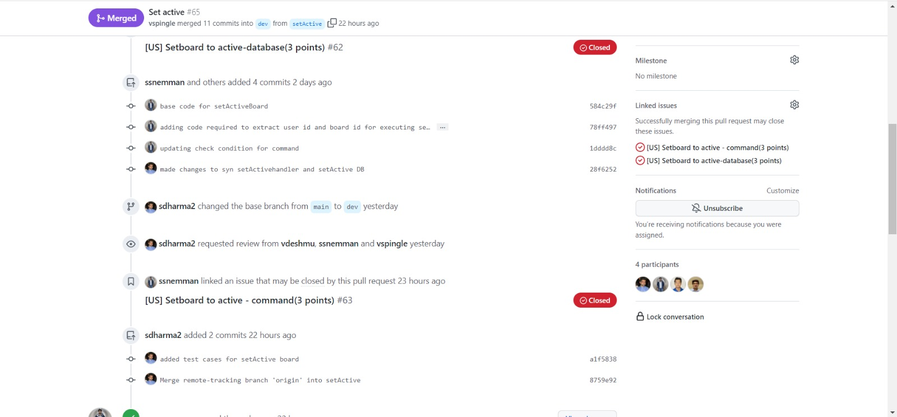

- ### **Shared code** (corollary practice):-
    * The move task functionality was implemented using shared code practice in which both the members were working on the same code. It helped to identify and resolve the bugs quicker as compared to single ownership deployment.   

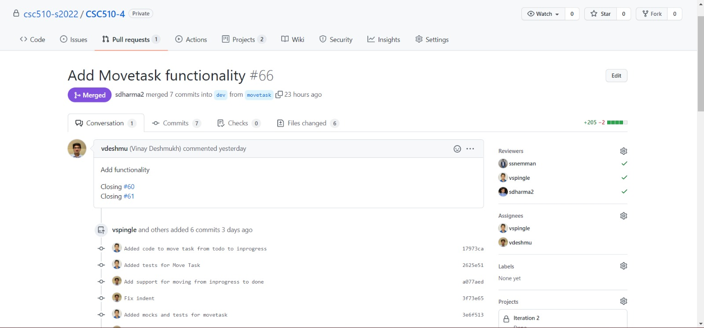

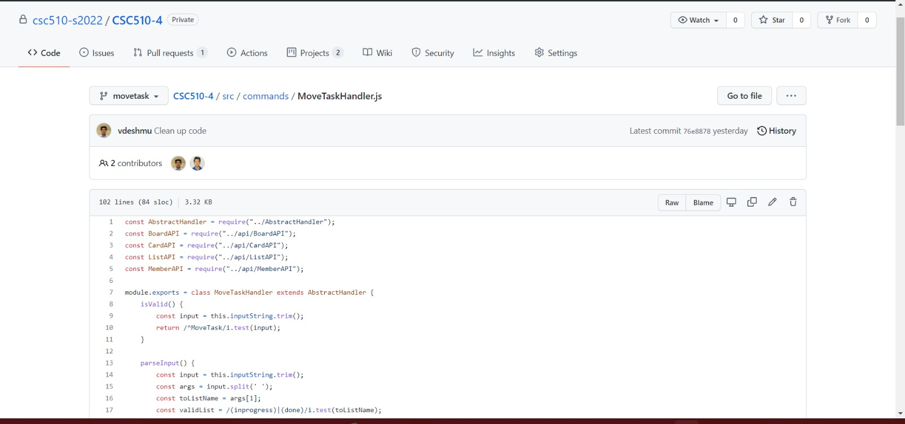

## **Iteration Worksheet**
**Iteration 1**

| Deliverable   | Item/Status   |  Issues/Tasks
| ------------- | ------------  |  ------------
| Use Case      | Create New Board | &nbsp;
|   Scenario 1  | Create new board and send link            |  [#44](https://github.ncsu.edu/csc510-s2022/CSC510-4/issues/44)
| Style guiding the code and removing extra logs   |    Complete        |  [#54](https://github.ncsu.edu/csc510-s2022/CSC510-4/issues/54)
| Unit Tests    | Complete      | [#48](https://github.ncsu.edu/csc510-s2022/CSC510-4/issues/48),  [createboardtestcode](test/commands/CreateBoardHandler.js)

| Deliverable   | Item/Status   |  Issues/Tasks
| ------------- | ------------  |  ------------
| Use Case      | Show current active board | &nbsp;
| Scenario 1| Fetch active board from database            |  [#47](https://github.ncsu.edu/csc510-s2022/CSC510-4/issues/47)
| Unit Tests    | Complete      | [#48](https://github.ncsu.edu/csc510-s2022/CSC510-4/issues/48),  [activeboardtestcode](test/commands/ShowActiveHandler.js)

| Deliverable   | Item/Status   |  Issues/Tasks
| ------------- | ------------  |  ------------
| Use Case      | List Tasks  | &nbsp;
|  Scenario 1  | Display all tasks in todo/done/inProgress lists              |  [#46](https://github.ncsu.edu/csc510-s2022/CSC510-4/issues/46)
| Scenario 2 | Display particular developer's tasks  | [#49](https://github.ncsu.edu/csc510-s2022/CSC510-4/issues/49)
| Unit Tests    | Complete      | [#48](https://github.ncsu.edu/csc510-s2022/CSC510-4/issues/48), [listtasktestcode](test/commands/ListTasksHandler.js)

| Deliverable   | Item/Status   |  Issues/Tasks
| ------------- | ------------  |  ------------
| Use Case      | Add new task to ToDo  | &nbsp;
| Scenario 1   | Add a task to the board             |  [#45](https://github.ncsu.edu/csc510-s2022/CSC510-4/issues/45)
| Implementing code for API calls |  Complete   | [#51](https://github.ncsu.edu/csc510-s2022/CSC510-4/issues/51)
| Unit Tests    | Complete      |  [#48](https://github.ncsu.edu/csc510-s2022/CSC510-4/issues/48), [addtasktestcode](test/commands/AddTaskHandler.js)

**Iteration 2**

| Deliverable   | Item/Status   |  Issues/Tasks
| ------------- | ------------  |  ------------ 
| Use Case      | Move card from list1 to list2 | &nbsp;
| Scenario 1 | Moves card from todo to inprogress             |  [#60](https://github.ncsu.edu/csc510-s2022/CSC510-4/issues/60)
| Scenario 2  |     Moves card from  inprogress  to done       |  [#61](https://github.ncsu.edu/csc510-s2022/CSC510-4/issues/61)
| Unit Tests    | Complete      |  [movetasktestcode](test/commands/MoveTaskHandler.js)

| Deliverable   | Item/Status   |  Issues/Tasks
| ------------- | ------------  |  ------------
| Use Case      | Set board to active   | &nbsp;
| Add database interactivity code | Complete             |  [#62](https://github.ncsu.edu/csc510-s2022/CSC510-4/issues/62)
| Add code to make API calls to Trello | Complete             |  [#63](https://github.ncsu.edu/csc510-s2022/CSC510-4/issues/63)
| Unit Tests    | Complete      |   [setactiveboardtestcode](test/commands/SetActiveHandler.js)

| Deliverable   | Item/Status   |  Issues/Tasks
| ------------- | ------------  |  ------------
| User Story     | Add multi user support for concurrent access of application  | &nbsp;
| Update application to support multi user authentication | Complete             |  [#64](https://github.ncsu.edu/csc510-s2022/CSC510-4/issues/64)
