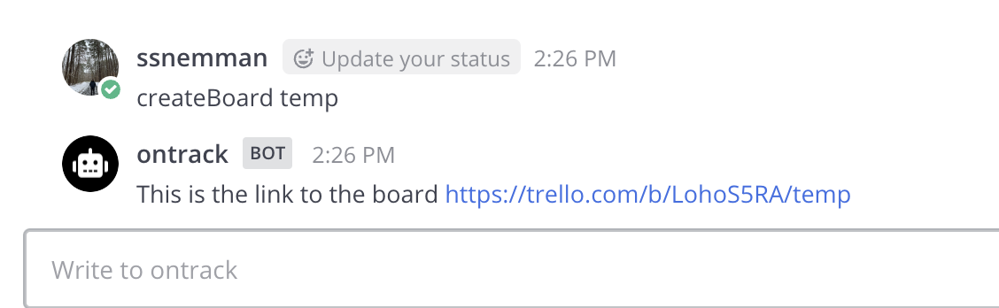
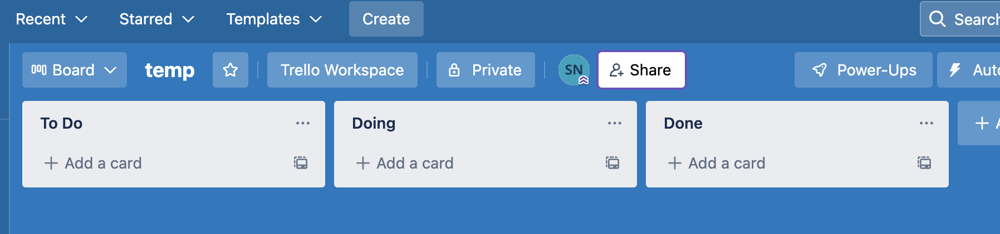
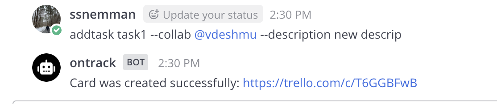
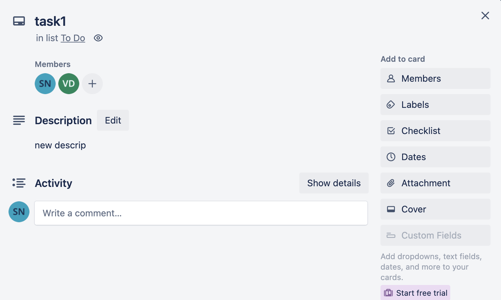
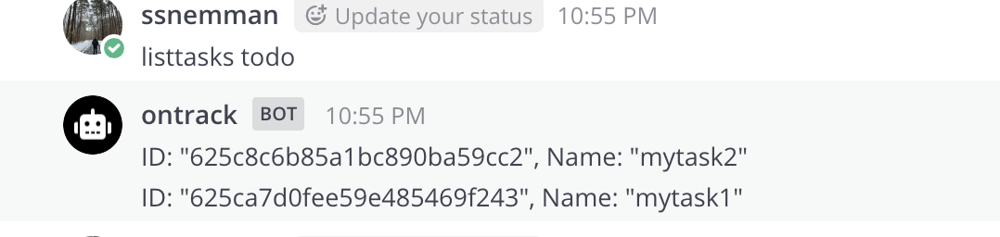
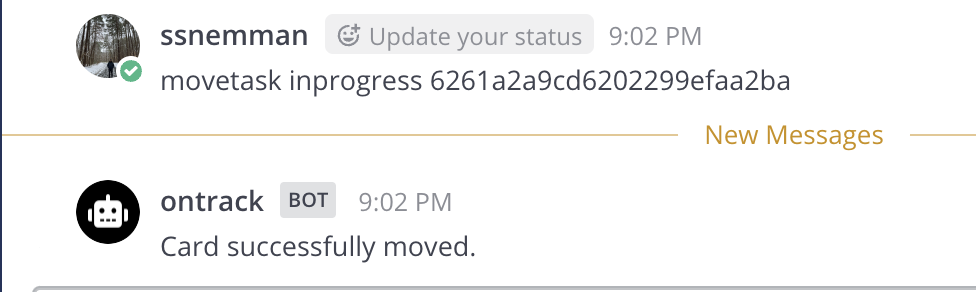
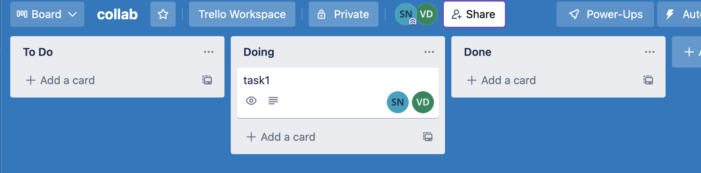

# REPORT

## Presentation video

[YouTube link](https://youtu.be/zwPmZdU9XSs)

## The problem our bot solved

The problem we intended to solve was preventing lapses in developer’s productivity due to frequent context switching. Developers on a daily basis switch between various tools and applications like Trello, Github, IDEs, etc. We have developed the OnTrack productivity bot to prevent this problem of context switching in the specific context of Trello Kanban boards.

For example, adding a new task to your project board on Trello requires you to move from your current environment to the browser, open the Trello webpage, find the right board and add the task to the board. By the time you return to the work you were doing prior to this, your concentration and state of flow has been disturbed. This is exacerbated by the fact that a developer has to perform such tasks multiple times each day.

OnTrack is a Mattermost bot that can automate your Trello workflows using a few textual commands. This saves time and energy spent in context switching and keeps you on track. The bot covers 4 primary use cases of creating project boards, adding tasks, displaying tasks, and moving tasks around in the board between various lists (todo/inprogress/done lists). All of these use cases can be achieved from the Mattermost bot channel through simple text commands and prevents the hassle of going through the original process and thus helps the developer avoid loss of productivity due to context switching.

---

## Primary features and screenshots.
1. *Creating a board on Trello*  

   User can create a new project board by typing the command “createBoard projectName” as shown below:

   Board temp is created on Trello with default columns as “to do “, “doing” or "inprogress" and “done”.

 

2. *Add new task to kanban board*
 User can add a new task to the kanban board along with details such as collaborators and description by typing the command as shown below:
 
 
  Task 1 is created as below:

3. *List tasks in todo/done/inProgress lists*
User can display tasks present in a particular column by entering the command "listTasks list_name" as displayed below:

4. *Moves card from todo/inprogress to inprogress/done*
User can move a card from one column to next column on the board by entering the command "moveTask destination_list_name ‘card’ " as shown below:

  The card “task1” is moved from todo to inprogress(doing) column.

---

## Our reflection on the development process and project.

### Development decisions that were made

While developing the application, we observed the bot acts like a CLI tool which accepts commands and performs certain actions based on valid syntax or correctly formed commands.

Hence, for ensuring a proper design to the application, we decided to use a variation of the [Chain of Responsibility design pattern](https://refactoring.guru/design-patterns/chain-of-responsibility), where each "command" (almost equivalent to a use case/feature in this case), is implemented via a subclass that inherits from an [Abstract superclass](https://github.ncsu.edu/csc510-s2022/CSC510-4/blob/main/src/AbstractHandler.js) which defines the contract that should be upheld by each command.

For instance, each class needs to implement the `isValid()` method, which is a synchronous method that determines whether this subclass will handle the action or not. If it is handling this method, then no further subclasses need to be checked.

By using this approach of creating subclasses for each "command", we were able to distribute the development work items in a clear and transparent way amongst the team mates. Furthermore, this allows easy extensibility of the project by subclassing the abstract superclass and implementing the `handle()` and `isValid()` methods.

PRs [#57](https://github.ncsu.edu/csc510-s2022/CSC510-4/pull/57/) and [#38](https://github.ncsu.edu/csc510-s2022/CSC510-4/pull/38/) are good examples of code changes that were done almost independently of each other and thereby reducing the chance of merge conflicts amongst team members.

By reducing the probability of merge conflicts, the team's productivity was greatly boosted as the team could focus on shipping code and not spend time putting out fires with merge conflicts.

This code structure also allowed us to add tests for different components of the application independently without affecting the code of other components, thereby preserving the `git blame` information of files.

### Reflection about project

We formed the following points after reflecting upon our project work:

- One of the things we could have done a bit better was the handling of edge cases and exceptions to reduce the mistakes made by the user while running the commands. For example, the [createBoard command](https://github.ncsu.edu/csc510-s2022/CSC510-4/blob/b53050be27113f98b896ce8bd8786bb6d280ff7e/src/commands/CreateBoardHandler.js#L19) does not handle special characters or symbols and aonly accepts alphanumeric characters. This command should ideally permit certain special characters.

- One of the aspects in which we feel we did well is the code testing. The rigorous test cases and mocks helped us simulate, run and test all possible use cases of the bot. We achieved testing coverage of more than 80%.

- The scrum-ban approach used for the project management helped the team track the progress of specific work items as moved from "todo" to "inprogress" to "done" on the kanban boards.

- We created [multiple](https://github.ncsu.edu/csc510-s2022/CSC510-4/projects/3) [project](https://github.ncsu.edu/csc510-s2022/CSC510-4/projects/4) [boards](https://github.ncsu.edu/csc510-s2022/CSC510-4/projects/5) to denote the different milestones within the project. By creating these boards, it was possible to clearly delineate the tasks for each milestone, thereby adding more detail and "tracking" to each task.

- To keep track of which code change corresponds with the issue/user story, we made sure to link a pull request to it's relevant issue which especially made life easier during the code sprints. For e.g., [Pull request 57](https://github.ncsu.edu/csc510-s2022/CSC510-4/pull/57) and [Issue 51](https://github.ncsu.edu/csc510-s2022/CSC510-4/issues/51)

- Key takeaways:
   * Use of 3rd party tokens and API keys (Trello). This was something we weren't familiar with prior to this project and we learnt how to integrate these elements into the codebase securely.
   * We found the the use of scrumban process and kanban boards extremely beneficial. These tools are very useful in keeping track of the project progress and also improve accountability of the team. Each of us will definitely be implementing these practices more, in our work in the future.

---

## Any limitations and future work.

* ### Limitations of our bot:

    - Trello is a third party API and we cannot give access to every user directly. Hence, every user has to create API key and token for the Trello app. Each user is then added to the PostgreSQL table and then verification is done at the backend using this token and API.

    - 'MoveTask' command using task ID for identifying a particular task on the current board. This is not ideal because it is a 25-bit alphanumeric id which the user has to copy and paste into the command.

    - 'SetAciveBoard' command also requires user to give the short ID of a particular board to set it to active.

    - The API key and tokens of a new user must be added to the PostgreSQL database in order to access Trello through the Mattermost bot.

* ### Future work for our bot:

    - OAuth can be used for user authentification to access the Trello API. This will prevent having to enter Trello API keys and tokens to the PostgreSQL database for new user.

    - Currently 'MoveTask' command requires user to provide Task ID of the task-card to be moved. Future work of this use case is to use card name/ task name in the command to move that particular task/card.

    - Currently 'SetActiveBoard' command requires user to provide short ID of the board he wishes to use for his next task. Future work of this usercase is to use boardname in the command.

    - The PostgresSQL can be replaced with AWS to avoid cummersome work needed to setup and use PostgreSQL at the backend.
